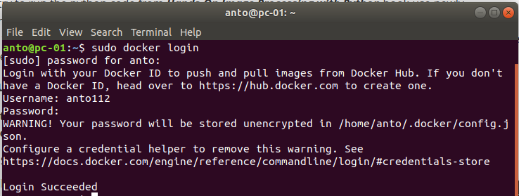
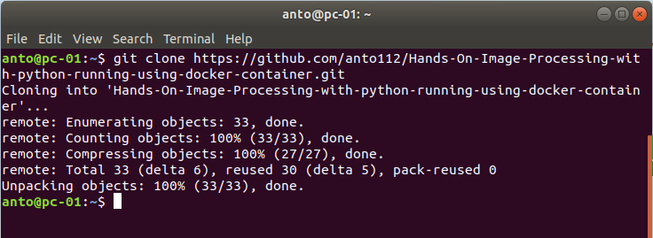
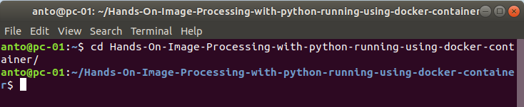
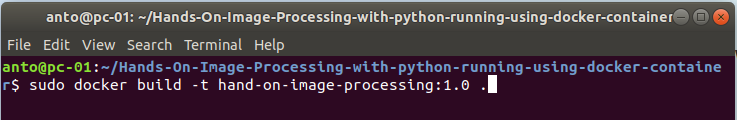
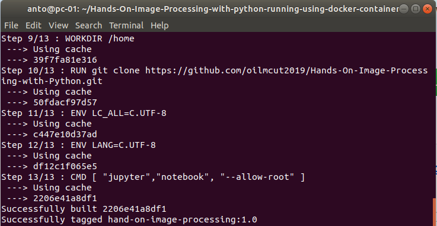
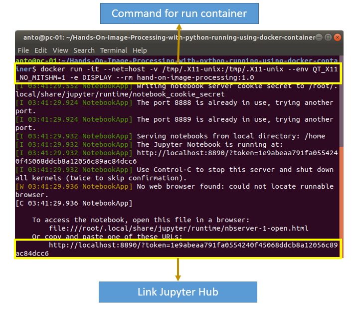
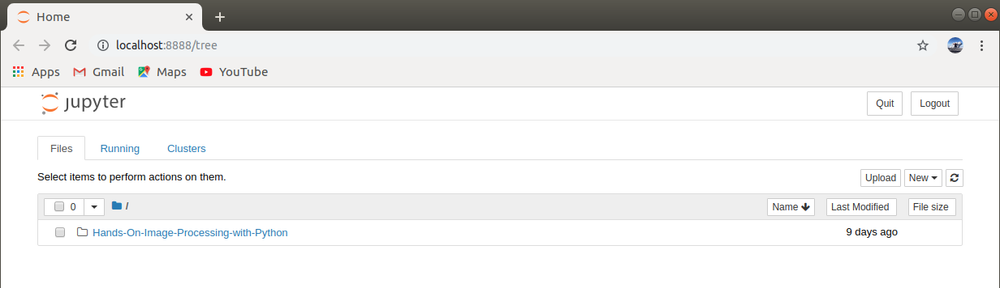
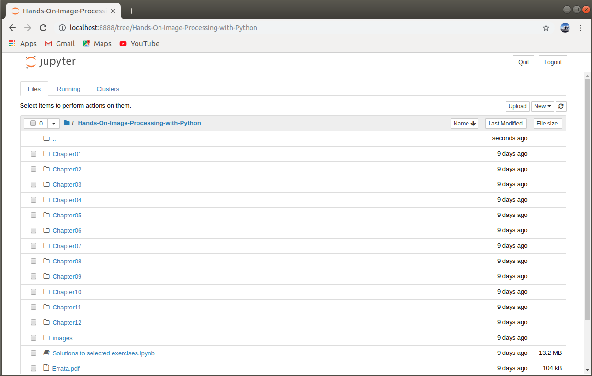

## Build image and container [Docker](https://docs.docker.com/get-started/)  for running python code from [Hands-On Image Processing with Python](https://github.com/PacktPublishing/Hands-On-Image-Processing-with-Python) book

___

When I try to run the python code from ***Hands-On Image Processing with Python*** book use newly environment, I get so many errors ***because the code needs the module or library with a specific version***.  to solve that problem I use ***docker*** to invent an environment that can be running the code. bellow this is the guideline for build the image and container docker.  

#### A. Linux Operating system (Linux OS)

1. ##### First you have to make sure you already login docker in terminal. If not you can use command bellow this.

   - $ sudo docker login

   It will ask username and password your docker hub. when you success login it will show like picture bellow this

   

   

2. ##### After that, clone or download this repository to your computer. If you use ***[git](https://www.git-scm.com/)***, you can follow the command bellow this

   - $ git clone https://github.com/anto112/Hands-On-Image-Processing-with-python-running-using-docker-container.git

     

     

3. ##### Change your working directory. 

   - $ cd Hands-On-Image-Processing-with-python-running-using-docker-container

     

     

4. ##### Build docker image using command in the terminal. use command bellow this

   - $ sudo docker build -t hand-on-image-processing:1.0 .

     

     **note: you can change the name and tag image to the name you want*
     
     *in this case :
     
     ​				***the name is : hand-on-image-processing***
     
     ​				***tag is : 1.0***
     
     **don't forget use . (dot) in the end of command*
     
   - when your build process finish, it will show like bellow this 

     

     

5. ##### After finish build the image, than you can running the container following this command

   - $ sudo docker run -it --net=host -v /tmp/.X11-unix:/tmp/.X11-unix --env QT_X11_NO_MITSHM=1 -e DISPLAY --rm hand-on-image-processing:1.0

     **explanation of command:*
     
     - *-it*= connect the container to terminal
     - *--net=host* = use network from local 
     - *-e DISPLAY*= export display server from local computer
     - *--rm* = remove the container when stop
     
     

   

6. ##### Open the **link** on the browser your computer such as chrome, internet explorer or Firefox, it will automatically go to your notebook .

   

   

   

   

#### Now available in [docker-hub](https://cloud.docker.com/u/anto112/repository/docker/anto112/hand-on-image-processing)

For convenient reason, now the image available in docker-hub. so you no need to build your image by yourself. you just running the container following this command.

- $ sudo docker run -it --net=host -v /tmp/.X11-unix:/tmp/.X11-unix --env QT_X11_NO_MITSHM=1 -e DISPLAY --rm anto112/hand-on-image-processing

Then just copy link to your browser to open the notebook. 

#### B. Windows Operating System (Windows OS)

- If you want to running in windows that have installed WSL ([*Windows Subsystem Linux*](https://docs.microsoft.com/en-us/windows/wsl/install-win10)) you can reference from **[here](https://nickjanetakis.com/blog/setting-up-docker-for-windows-and-wsl-to-work-flawlessly)**. Make sure you need to install Xserver for windows, such as [Xming](https://sourceforge.net/projects/xming/), [X410](https://token2shell.com/howto/x410/) and Etc.

##### connect wit me in email: m07158031@mail2.mcut.edu.tw

